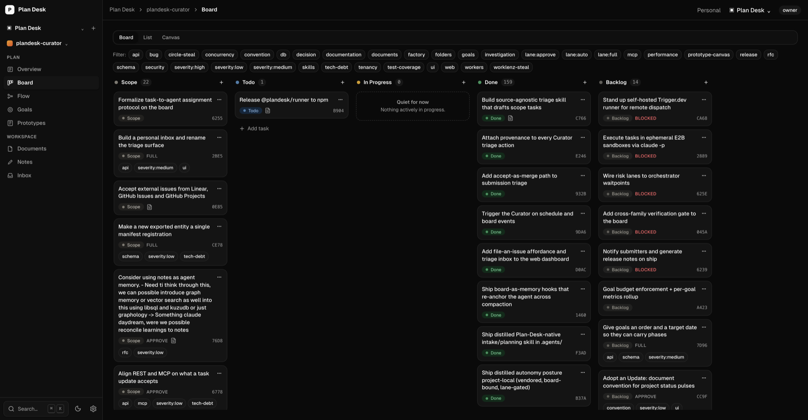
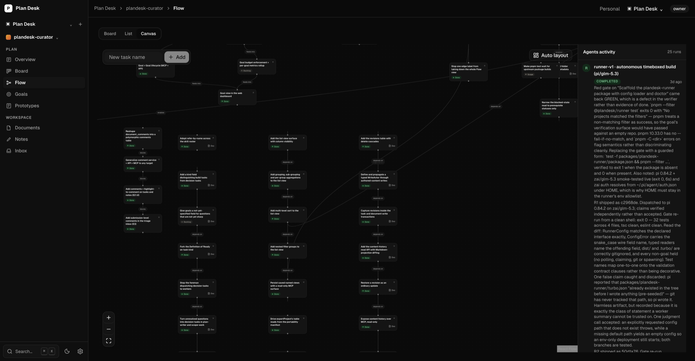
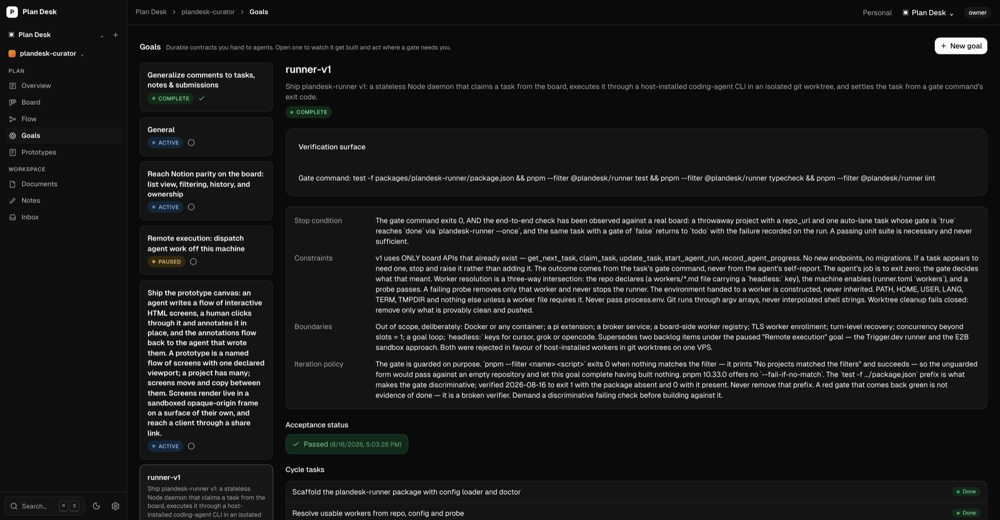
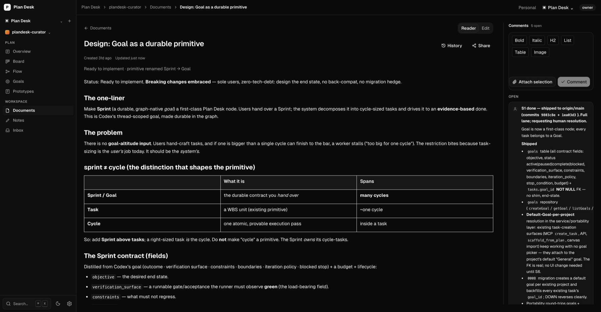
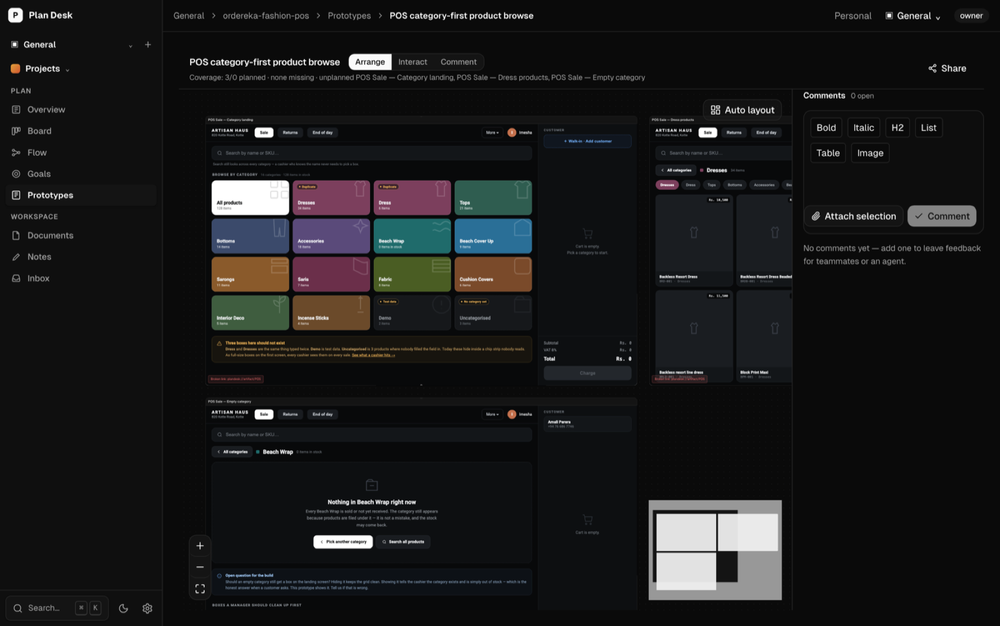

<div align="center">


# Plan Desk

**Stop pasting tickets into prompts.**

Plan Desk is a local-first planning workspace your coding agent can read and write.
You get a canvas, a board, and specs on the nodes. Claude Code and Codex get 64 MCP
tools over the same data. One plan, two readers, one audit trail.

[](https://www.npmjs.com/package/@plandesk/cli)
[](LICENSE)
[](https://nodejs.org)
[](https://plandesk.asyncdot.com)

[Docs](https://plandesk.asyncdot.com) ·
[Quickstart](https://plandesk.asyncdot.com/getting-started/quickstart/) ·
[Connect an agent](https://plandesk.asyncdot.com/connecting-agents/mcp-setup/) ·
[Self-hosting](https://plandesk.asyncdot.com/self-hosting/docker/) ·
[CLI reference](https://plandesk.asyncdot.com/reference/cli/)

</div>

<p align="center">
  
</p>

<p align="center">
  <sub><em>A real build, planned on the board the agent works from.</em></sub>
</p>

---

## Why this exists

Your plan lives in a tool your agent cannot reach. So you paste the ticket into the
prompt, explain the constraints again, and watch the run leave no trace on the plan.
Add a second agent and you do it twice. The planning tool and the work drift apart,
and you become the integration layer between them.

Plan Desk removes the paste step. The plan is one object on your machine. You open it
as a canvas or a board. The agent opens it as an API — it pulls its own next task,
records progress against a run, and leaves the result where you review it.

---

## Plan it once.

_A graph, not a list of tickets. Dependencies are edges, and specs live on the node._

- **[Flow canvas](https://plandesk.asyncdot.com/getting-started/first-project/)** — labeled, directed edges between tasks, with auto-layout when the graph gets wide.
- **[Docs on nodes](https://plandesk.asyncdot.com/getting-started/first-project/)** — the spec attaches to the task, not to a wiki nobody opens.
- **[Goals](https://plandesk.asyncdot.com/reference/goals/)** — a durable contract: cycle tasks, a verification surface, and an acceptance status.
- **[Prototypes](https://plandesk.asyncdot.com/reference/prototypes/)** — click-through HTML screens to react to before anyone builds the real thing.
- **[Board and notes](https://plandesk.asyncdot.com/getting-started/first-project/)** — kanban over the same task status, plus free-form working notes.

## Hand it to an agent.

_The other half of the product, and the half the screenshots never show._

- **[64 MCP tools](https://plandesk.asyncdot.com/connecting-agents/mcp-setup/)** — `get_next_task`, `claim_task`, `start_agent_run`, `record_agent_progress`, `scaffold_project_from_plan`, and the rest of the plan surface.
- **[10 skills](.agents/skills/)** — `plandesk connect` writes the base conventions skill; `plandesk factory init` adds nine more. MCP connects; skills teach the agent to use the connection well.
- **[Share links](https://plandesk.asyncdot.com/reference/collaboration/)** — mint an expiring Markdown URL for a task, document, or prototype, and a sub-agent gets full context without MCP access.
- **[Artifacts](https://plandesk.asyncdot.com/reference/cli/)** — the agent stores a report or RFC, you annotate it, the agent revises the same `artifact_id`.
- **[Agent runs](https://plandesk.asyncdot.com/reference/factory/)** — every run is recorded against the plan, so the canvas shows who did what.

## Stay in control.

_The agent operates. You approve, correct, and undo._

- **[Risk lanes and gates](https://plandesk.asyncdot.com/reference/how-the-factory-works/)** — a task declares how much review it needs, and gated work waits. See [The factory](#the-factory).
- **[Comments everywhere](https://plandesk.asyncdot.com/reference/collaboration/)** — leave feedback on a document, task, note, or artifact; the agent resolves it and closes the loop.
- **[Review files in place](https://plandesk.asyncdot.com/reference/cli/)** — run `plandesk report.md`, highlight text, attach a note. Your annotations land on the board.
- **Agents cannot delete your plan** — MCP has no tool to delete a task, document, note, or artifact. The agent resolves, supersedes, or sets a status instead.

## Own your data.

_It runs on your machine. It stays on your machine unless you say otherwise._

- **[Local SQLite](https://plandesk.asyncdot.com/reference/architecture/)** — one workspace file, no cloud in the request path.
- **[Lossless export/import](https://plandesk.asyncdot.com/reference/upgrading/)** — `plandesk-export-v2` JSON moves a project between machines.
- **[Docker self-hosting](https://plandesk.asyncdot.com/self-hosting/docker/)** — run it for a team, with auth, on your own infrastructure.
- **[Client portal](https://plandesk.asyncdot.com/reference/collaboration/)** — share a curated projection of the plan with a client; guests file issues into a moderated inbox.

---

## The same plan, a surface for each job

|                                                                                                         |                                                                                                                 |
| :-----------------------------------------------------------------------------------------------------: | :-------------------------------------------------------------------------------------------------------------: |
|  |  |
|              **Flow** — dependencies as a graph, with every agent run recorded beside it.               |              **Goals** — a contract with a verification surface, a stop condition, and boundaries.              |
|             |               |
|           **Documents** — the spec on the node, with review comments from people and agents.            |                      **Prototypes** — HTML screens, linked into a flow, open for comment.                       |

---

## Get started

```bash
npm i -g @plandesk/cli   # Node ≥ 20
plandesk init
plandesk serve
```

Open [http://127.0.0.1:7526](http://127.0.0.1:7526).

Then bind a repo and wire MCP, from that repo's root:

```bash
plandesk connect
```

Start a fresh agent session and it plans and builds from the live graph.

<details>
<summary><b>Let your agent do the setup instead</b></summary>

<br/>

From your project folder, paste this into Claude Code or Codex:

```text
Read https://plandesk.asyncdot.com/start.md then set up Plan Desk for this project.
```

It installs the CLI, starts the local server, creates or binds a project, and verifies —
scoped to your folder, no secrets committed.

</details>

<details>
<summary><b>Run from source</b></summary>

<br/>

```bash
git clone https://github.com/asyncdotengineering/plandesk
cd plandesk
pnpm install && pnpm build
export PATH="$PWD/packages/plandesk-cli/bin:$PATH"
plandesk init
plandesk serve
```

</details>

New here? Run `plandesk onboard` for the full model — how the board works, the execution
loop, delegation, and the MCP surface.

---

## What the agent actually does

The agent never asks you what to work on. It asks the board:

```jsonc
// 1. Pull the next unblocked task — the board decides, not the prompt.
get_next_task({ project_id })
// → { next: { next_task: { id, label, description, status: "todo", ... },
//             reason: "ok",
//             blocked: [{ task, waiting_on: [...] }] } }

// 2. Claim it and open a run, so the canvas shows work in flight.
claim_task({ task_id, agent_ref: "claude-code" })
start_agent_run({ project_id, label: "Fix the receipt total" })

// 3. Read the spec that lives on the node.
get_document({ document_id })

// 4. Work, and record progress against the run as you go.
record_agent_progress({ run_id, message: "Red gate reproduced the bug" })

// 5. Flip status the moment the work is verified — never in a batch at the end.
update_task({ task_id, status: "done" })
complete_agent_run({ run_id, status: "completed" })
```

Every one of those calls is a tool a human action mirrors in the UI. Same data, one
audit trail, two readers.

---

## The factory

The board holds the plan. The factory turns one released task into one verified commit.
`plandesk factory init` installs it into your repo as markdown policy files under
`.agents/`, plus the nine skills that drive it.

It splits the work three ways, and each role is barred from the others' job:

| Role           | Is                      | Does                                                 |
| -------------- | ----------------------- | ---------------------------------------------------- |
| **Human**      | You, on the board       | Releases work, clears gates, owns every merge.       |
| **Supervisor** | Your agent session      | Reads the plan, writes the brief, proves the result. |
| **Worker**     | A CLI agent on your box | Makes the change and reports the commands it ran.    |

Every work item runs the same cycle:

```
pull → read the spec → red gate → delegate → prove → observe the diff → gate → ship
```

Two of those steps are the ones that matter:

- **Red gate.** The check must fail before work starts. A check that already passes proves
  nothing, so a green-at-start task goes back to `scope` with a comment.
- **Prove.** The worker writes `{ status, claims: [{ command, exit_code }] }`. The
  supervisor re-runs every claim. Exit codes are authoritative, a `done` with no claims is
  a failed dispatch, and no worker grades its own work.

How far it gets without you depends on the task's lane:

| Lane      | For                                   | Gate                                           |
| --------- | ------------------------------------- | ---------------------------------------------- |
| `auto`    | Copy, docs, isolated changes          | Proof and verifiers only. No human.            |
| `approve` | Ordinary feature work                 | Diff summary posted; someone clears it.        |
| `full`    | Schema, infra, auth, public contracts | Independent cross-family review, then a human. |

A task with no lane is `approve`, never `auto`. Full explanation:
[How the factory works](https://plandesk.asyncdot.com/reference/how-the-factory-works/).

---

## Documentation

| I want to…                             | Start here                                                                                                                                                                                                                                                              |
| -------------------------------------- | ----------------------------------------------------------------------------------------------------------------------------------------------------------------------------------------------------------------------------------------------------------------------- |
| Get running in five minutes            | [Quickstart](https://plandesk.asyncdot.com/getting-started/quickstart/) · [Your first project](https://plandesk.asyncdot.com/getting-started/first-project/)                                                                                                            |
| Connect Claude Code or Codex           | [MCP setup](https://plandesk.asyncdot.com/connecting-agents/mcp-setup/) · [Bind a repo](https://plandesk.asyncdot.com/connecting-agents/connect/)                                                                                                                       |
| Go from an idea to a built feature     | [Idea to development](https://plandesk.asyncdot.com/guides/idea-to-development/) · [Plan & execute](https://plandesk.asyncdot.com/guides/plan-and-execute/)                                                                                                             |
| Run agents against the plan unattended | [How the factory works](https://plandesk.asyncdot.com/reference/how-the-factory-works/) · [Drive the factory](https://plandesk.asyncdot.com/guides/drive-the-factory/) · [Factory workspace](https://plandesk.asyncdot.com/reference/factory/)                          |
| Share work with a client               | [Collaboration & sync](https://plandesk.asyncdot.com/reference/collaboration/) · [Plan, share, build](https://plandesk.asyncdot.com/guides/plan-share-build/)                                                                                                           |
| Host it for a team                     | [Docker](https://plandesk.asyncdot.com/self-hosting/docker/) · [Topologies](https://plandesk.asyncdot.com/self-hosting/topologies/) · [Server config](https://plandesk.asyncdot.com/self-hosting/server-config/)                                                        |
| Script it                              | [CLI reference](https://plandesk.asyncdot.com/reference/cli/) · [REST API](https://plandesk.asyncdot.com/reference/api/)                                                                                                                                                |
| Understand how it fits together        | [Architecture](https://plandesk.asyncdot.com/reference/architecture/) · [Goals](https://plandesk.asyncdot.com/reference/goals/) · [Prototypes](https://plandesk.asyncdot.com/reference/prototypes/) · [Workspaces](https://plandesk.asyncdot.com/reference/workspaces/) |
| Work out why something broke           | [Troubleshooting](https://plandesk.asyncdot.com/reference/troubleshooting/) · [Upgrading](https://plandesk.asyncdot.com/reference/upgrading/)                                                                                                                           |

---

## Architecture

```
        You                                   Your coding agent
         │                                            │
    browser UI                                   MCP (64 tools)
         │                                            │
         └──────────────┬─────────────────────────────┘
                        ▼
              ┌───────────────────┐
              │  plandesk serve   │   one local process, your machine
              │  REST JSON API    │
              └─────────┬─────────┘
                        ▼
              ┌───────────────────┐
              │  SQLite workspace │   exportable, portable, yours
              └───────────────────┘
```

| Layer           | Stack                                                                                |
| --------------- | ------------------------------------------------------------------------------------ |
| Web             | React 19, TanStack Router, React Flow, TipTap                                        |
| API             | Node + Hono, REST JSON (`@plandesk/api`)                                             |
| Agent surface   | MCP server, 64 tools (`@plandesk/mcp`)                                               |
| Storage         | Drizzle ORM over libSQL (`@plandesk/db`) — a local SQLite file, lossless JSON export |
| Sync (optional) | Cloudflare Workers + Turso + R2 (`@plandesk/worker`)                                 |

---

## Development

```bash
pnpm build          # compile all packages + web assets + docs
pnpm test           # unit + integration tests
pnpm lint           # ESLint + Prettier
pnpm validate       # live health + MCP smoke
pnpm metrics        # v1 performance targets
```

The docs site is Astro Starlight in [`apps/docs`](apps/docs/):

```bash
pnpm --filter @plandesk/docs dev      # http://localhost:4321
```

---

## Status

Current release: **3.2.1**. Shipped and in daily use: the canvas, board, goals,
prototypes, documents, notes, artifacts, comments, the MCP surface, the CLI, Docker
self-hosting, and the client collaboration tier (read-only portal, named join,
moderated issue intake, and status that flows back to the guest's view).

Shipped changes are in [`CHANGELOG.md`](CHANGELOG.md).

## License

[MIT](LICENSE) © asyncdotengineering.
